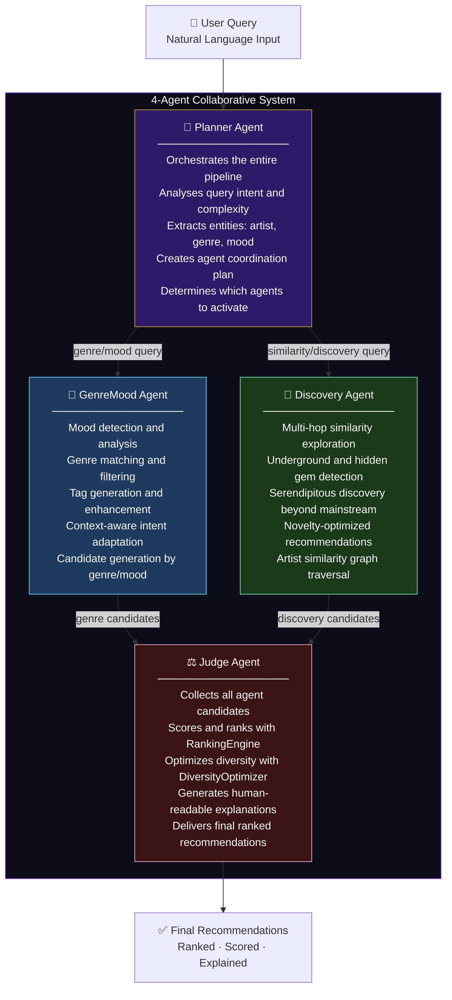
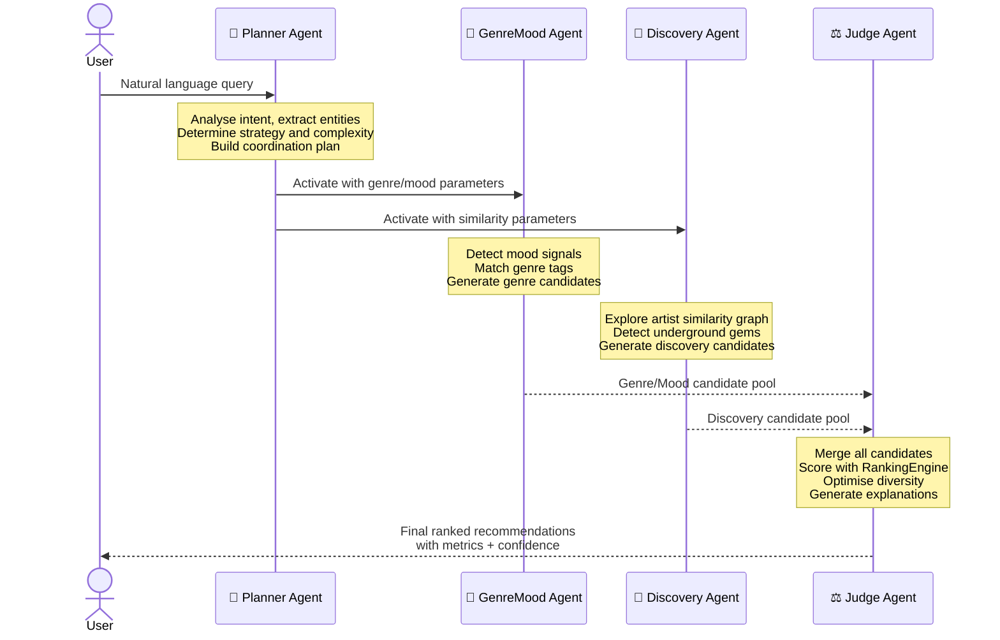
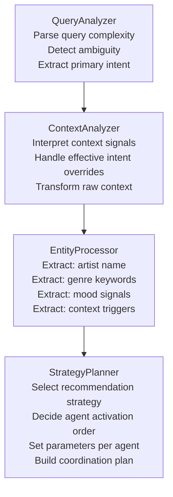
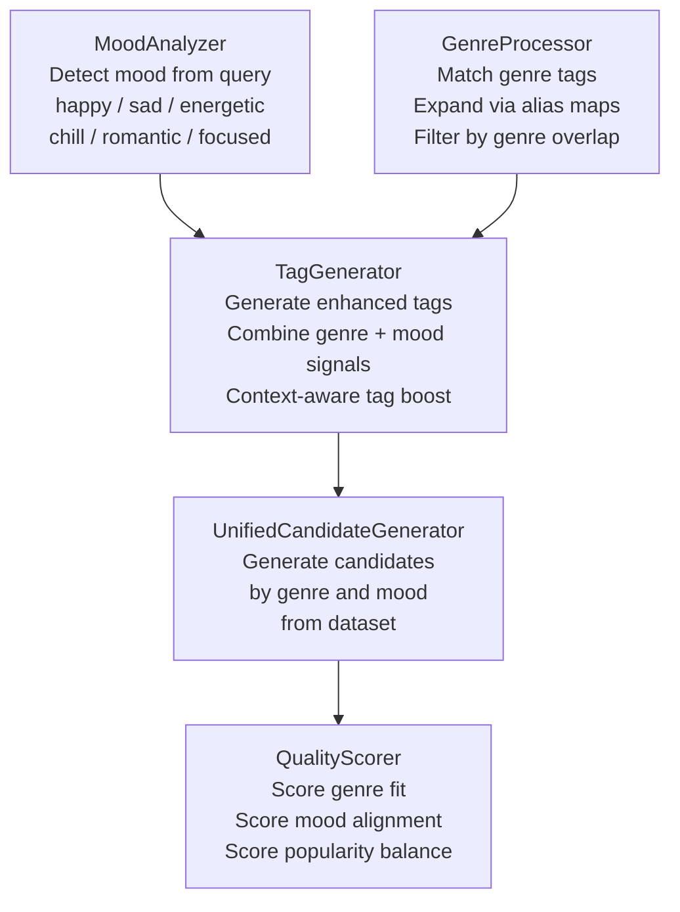
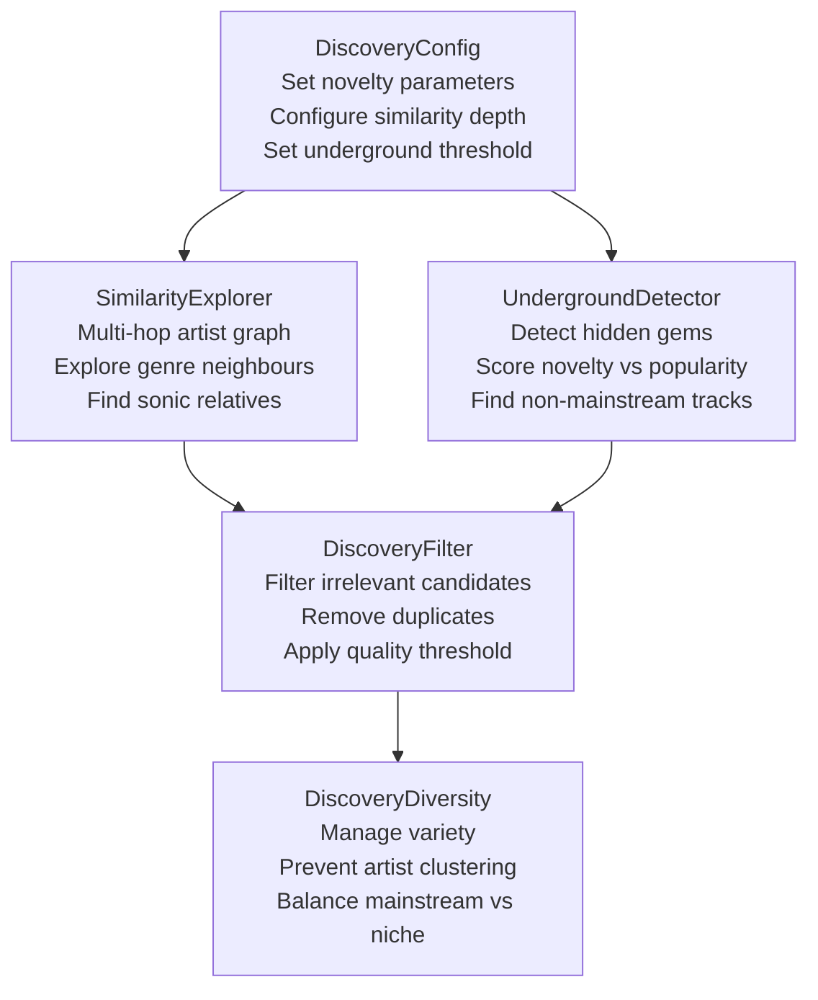
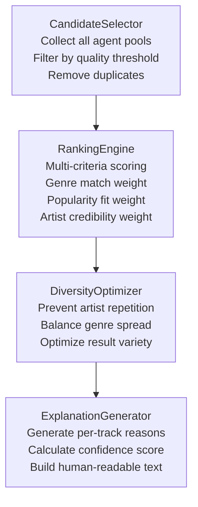
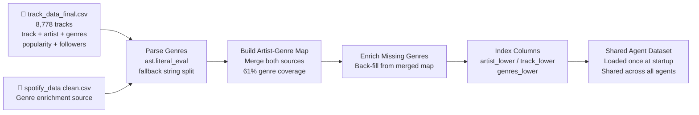
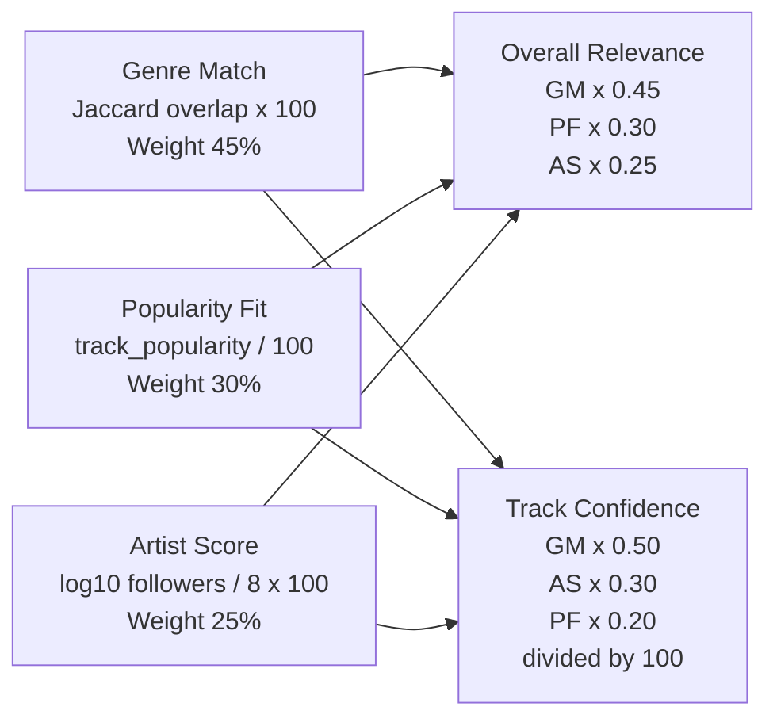
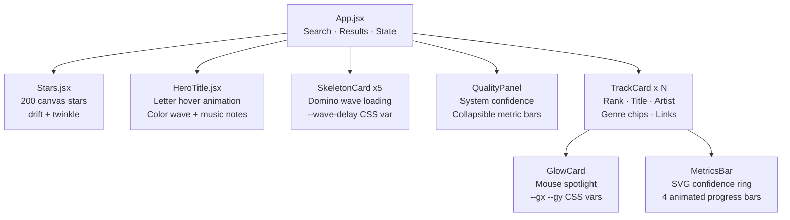



<div align="center">

[](https://git.io/typing-svg)

<br/>

[](https://huggingface.co/spaces/ashu-17/mantarang)
[](https://python.org)
[](https://react.dev)
[](https://fastapi.tiangolo.com)
[](https://huggingface.co/spaces/ashu-17/mantarang)

</div>

---

## 📌 Table of Contents

- [About the Project](#-about-the-project)
- [4-Agent Architecture](#-4-agent-architecture)
- [Agent Collaboration Flow](#-agent-collaboration-flow)
- [Agent Deep Dive](#-agent-deep-dive)
- [Data Pipeline](#-data-pipeline)
- [Metric Formulas](#-metric--confidence-formulas)
- [Frontend Components](#-frontend-component-tree)
- [Tech Stack](#-tech-stack)
- [Run Locally](#-run-locally)
- [Project Structure](#-project-structure)
- [Team](#-built-by)

---

## 🎵 About the Project

**ManTarang** is a **Music Emotion Recognition (MER)** system built on a **4-agent collaborative AI architecture**. When a user types a natural-language query, four specialized AI agents coordinate in a pipeline — each with a distinct role — to produce ranked, explainable music recommendations.

> Each agent contributes its expertise. The Planner leads, two specialists generate candidates, and the Judge delivers the final verdict.

<div align="center">

| Query | Planner decides | Agents activated | Output |
|-------|----------------|-----------------|--------|
| `"songs like Radiohead"` | Similarity strategy | Discovery + GenreMood | Genre-DNA matched tracks |
| `"chill lo-fi for studying"` | Context strategy | GenreMood | lo-fi / chillhop ranked list |
| `"dark indie rock"` | Genre strategy | GenreMood + Discovery | Confidence-scored results |
| `"energetic hip hop"` | Mood strategy | GenreMood | High-energy ranked tracks |

</div>

---

## 🤖 4-Agent Architecture



---

## 🔄 Agent Collaboration Flow



---

## 🧠 Agent Deep Dive

### 🧭 Agent 1 — Planner Agent
> _The orchestrator. Runs first. Decides everything else._



**Outputs to:** GenreMood Agent + Discovery Agent with a structured coordination plan.

---

### 🎼 Agent 2 — GenreMood Agent
> _The emotion specialist. Translates feelings into music._



**Outputs to:** Judge Agent with a pool of genre/mood-matched track candidates.

---

### 🔭 Agent 3 — Discovery Agent
> _The explorer. Finds what you didn't know you needed._



**Outputs to:** Judge Agent with a pool of discovery/similarity candidates.

---

### ⚖️ Agent 4 — Judge Agent
> _The final decision maker. Ranks, diversifies, and explains._



**Outputs:** Final ranked recommendations with metrics, confidence, and explanations.

---

## 🗄 Data Pipeline



---

## 📐 Metric & Confidence Formulas



<div align="center">

| Metric | Formula | Calculated By |
|--------|---------|--------------|
| Genre Match | `genre_overlap(track, target) × 100` | GenreMood + Discovery Agents |
| Popularity Fit | `popularity / 100 × 100` | Judge Agent |
| Artist Score | `min(100, log₁₀(followers)/8 × 100)` | Judge Agent |
| Overall Relevance | `GM×0.45 + PF×0.30 + AS×0.25` | Judge Agent |
| Track Confidence | `(GM×0.50 + AS×0.30 + PF×0.20) / 100` | Judge Agent |
| System Confidence | `avg×75 + strategy_premium + diversity_bonus` | Judge Agent |

</div>

---

## 🖥 Frontend Component Tree



---

## 🛠 Tech Stack

<div align="center">

| Layer | Technology | Purpose |
|-------|-----------|---------|
| 🤖 Agents | Python 3.11 — 4 agent classes | Planner, GenreMood, Discovery, Judge |
| 🐍 Backend | FastAPI + Uvicorn | REST API, routing, lifespan |
| 📊 Data | Pandas + Spotify CSV | 8,778-track shared agent dataset |
| ⚛️ Frontend | React 18 + Vite | SPA, hot reload, /api proxy |
| 🎞 Animation | Framer Motion | Transitions, AnimatePresence |
| 🌌 Canvas | HTML5 Canvas API | 200-star animated starfield |
| 🐳 Container | Docker multi-stage | Node build then Python serve |
| ☁️ Deploy | HuggingFace Spaces | CPU Basic, free, port 7860 |

</div>

---

## 🚀 Run Locally

```bash
# 1. Clone
git clone https://github.com/Ashutosh-177/ManTarang-AI-Powered-Music-Recommendation-System.git
cd ManTarang-AI-Powered-Music-Recommendation-System

# 2. Backend  (terminal 1)
pip install -r requirements-hf.txt
uvicorn mantarang.src.api.backend:app --host 0.0.0.0 --port 8000 --reload

# 3. Frontend  (terminal 2)
cd mantarang-ui
npm install
npm run dev
# open http://localhost:5173
```

---

## 📁 Project Structure

```
ManTarang/
├── mantarang/src/
│   ├── agents/
│   │   ├── planner/           ← Agent 1: Orchestrates pipeline
│   │   │   ├── agent.py
│   │   │   ├── query_analyzer.py
│   │   │   ├── context_analyzer.py
│   │   │   ├── strategy_planner.py
│   │   │   └── entity_processor.py
│   │   ├── genre_mood/        ← Agent 2: Emotion and genre specialist
│   │   │   ├── agent.py
│   │   │   └── components/
│   │   ├── discovery/         ← Agent 3: Similarity and novelty explorer
│   │   │   ├── agent.py
│   │   │   ├── similarity_explorer.py
│   │   │   └── underground_detector.py
│   │   └── judge/             ← Agent 4: Ranks and explains results
│   │       ├── agent.py
│   │       └── components/
│   │           ├── ranking_engine.py
│   │           ├── diversity_optimizer.py
│   │           └── explanation_generator.py
│   └── api/
│       └── backend.py         ← FastAPI routes
│
├── mantarang-ui/src/
│   ├── App.jsx
│   └── components/
│       ├── HeroTitle.jsx
│       ├── TrackCard.jsx
│       ├── MetricsBar.jsx
│       ├── SkeletonCard.jsx
│       ├── Stars.jsx
│       └── GlowCard.jsx
│
├── track_data_final.csv        ← Shared agent dataset (8,778 tracks)
├── Dockerfile
├── METRICS.md
└── PROJECT_REPORT.md
```

---

## 👥 Built By

<div align="center">

<table>
<tr>
<td align="center" width="50%">
<h3>Ashutosh Kumar Singh</h3>
<code>Enrollment No. 92301733016</code>
</td>
<td align="center" width="50%">
<h3>Aditya Raj</h3>
<code>Enrollment No. 92301733062</code>
</td>
</tr>
</table>

<br/>

**Music Emotion Recognition (MER) — 2026**

</div>


