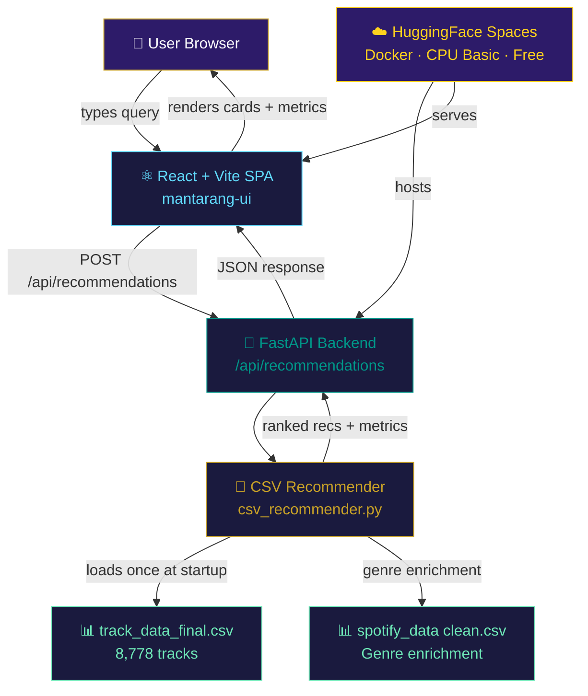
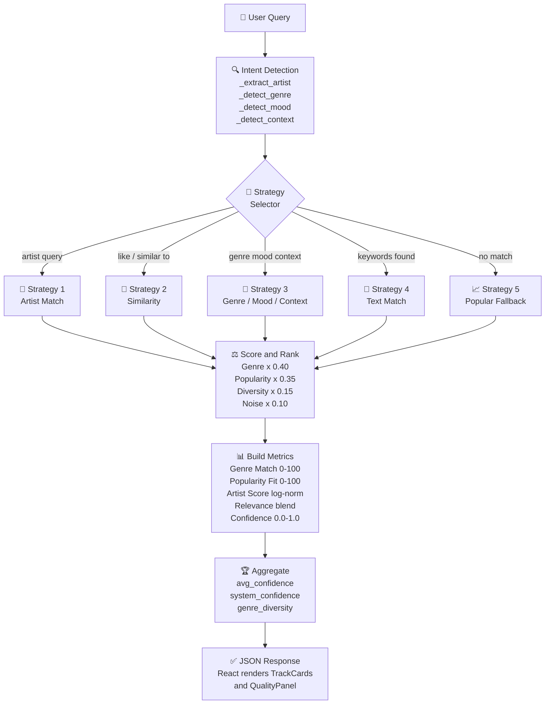
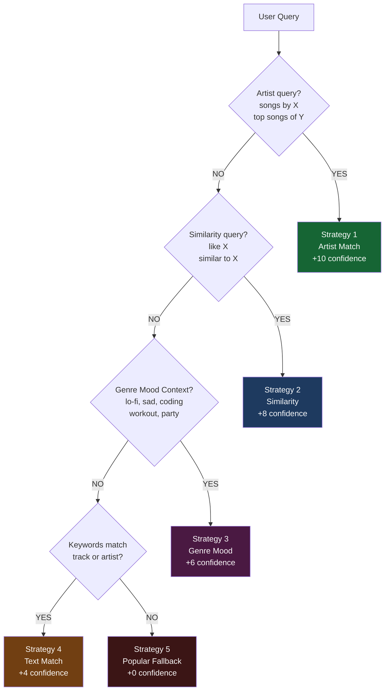
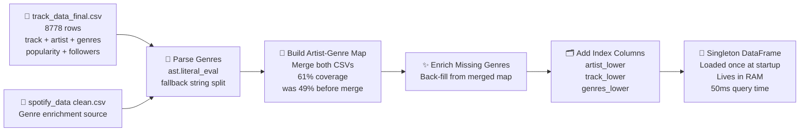
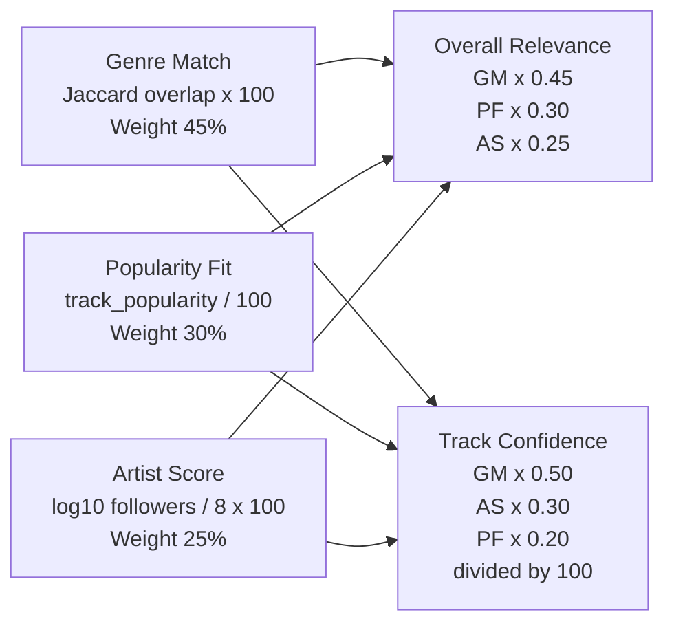
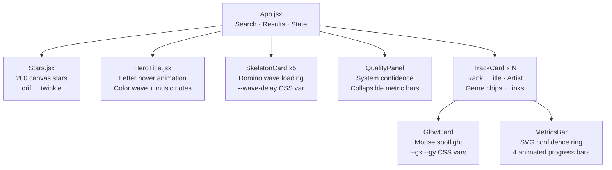

<div align="center">


[](https://git.io/typing-svg)

<br/>

[](https://huggingface.co/spaces/ashu-17/mantarang)
[](https://python.org)
[](https://react.dev)
[](https://fastapi.tiangolo.com)
[](https://huggingface.co/spaces/ashu-17/mantarang)

</div>

---

## 📌 Table of Contents

- [About the Project](#-about-the-project)
- [System Architecture](#-system-architecture)
- [Recommendation Pipeline](#-recommendation-pipeline)
- [Strategy Selection](#-strategy-selection--decision-tree)
- [Data Pipeline](#-data-pipeline)
- [Metric Formulas](#-metric--confidence-formulas)
- [Frontend Components](#-frontend-component-tree)
- [Tech Stack](#-tech-stack)
- [Run Locally](#-run-locally)
- [Project Structure](#-project-structure)
- [Team](#-built-by)

---

## 🎵 About the Project

**ManTarang** is a **Music Emotion Recognition (MER)** system that maps free-form natural-language queries to emotionally and contextually relevant music tracks. It combines rule-based NLU, multi-criteria scoring, and a curated Spotify dataset to deliver fast, diverse, and **fully explainable** recommendations — with no GPU required.

> _"Why did you recommend this track?"_ — ManTarang tells you, with numbers.

<div align="center">

| Input | Strategy | Output |
|-------|----------|--------|
| `"songs like Radiohead"` | Similarity | 10 alt-rock tracks with genre DNA match |
| `"chill lo-fi for studying"` | Genre + Context | lo-fi / chillhop, ranked by relevance |
| `"dark indie rock"` | Genre / Mood | genre-matched, confidence scored |
| `"energetic hip hop"` | Genre / Mood | high-popularity hip-hop tracks |
| `"late night drives"` | Context Map | rock / pop / alternative blend |

</div>

---

## 🏗 System Architecture



---

## 🔄 Recommendation Pipeline



---

## 🌿 Strategy Selection — Decision Tree



---

## 🗄 Data Pipeline



---

## 📐 Metric & Confidence Formulas



<div align="center">

| Metric | Formula | Display |
|--------|---------|---------|
| Genre Match | `genre_overlap(track, target) × 100` | Animated bar |
| Popularity Fit | `popularity / 100 × 100` | Animated bar |
| Artist Score | `min(100, log₁₀(followers)/8 × 100)` | Animated bar |
| Overall Relevance | `GM×0.45 + PF×0.30 + AS×0.25` | Animated bar |
| Track Confidence | `(GM×0.50 + AS×0.30 + PF×0.20) / 100` | SVG ring |
| System Confidence | `avg×75 + strategy_premium + diversity_bonus` | Quality panel |

</div>

```
System_Confidence = min(100,
    avg_track_confidence × 100 × 0.75
    + Strategy_Premium   ← artist=10, similarity=8, genre=6, text=4, fallback=0
    + Diversity_Bonus    ← min(10, unique_genre_count)
)
```

---

## 🖥 Frontend Component Tree



---

## 🛠 Tech Stack

<div align="center">

| Layer | Technology | Purpose |
|-------|-----------|---------|
| 🐍 Backend | Python 3.11 + FastAPI | REST API, routing, lifespan |
| 📊 Data | Pandas + CSV | 8,778-track in-memory dataset |
| ⚛️ Frontend | React 18 + Vite | SPA, hot reload, /api proxy |
| 🎞 Animation | Framer Motion | Transitions, AnimatePresence |
| 🌌 Canvas | HTML5 Canvas API | 200-star animated starfield |
| 🐳 Container | Docker multi-stage | Node build then Python serve |
| ☁️ Deploy | HuggingFace Spaces | CPU Basic, free, port 7860 |

</div>

---

## 🚀 Run Locally

```bash
# 1. Clone
git clone https://github.com/Ashutosh-177/ManTarang-AI-Powered-Music-Recommendation-System.git
cd ManTarang-AI-Powered-Music-Recommendation-System

# 2. Backend  (terminal 1)
pip install -r requirements-hf.txt
uvicorn mantarang.src.api.backend:app --host 0.0.0.0 --port 8000 --reload

# 3. Frontend  (terminal 2)
cd mantarang-ui
npm install
npm run dev
# open http://localhost:5173
```

---

## 📁 Project Structure

```
ManTarang/
├── mantarang/                       ← Python backend
│   └── src/
│       ├── api/backend.py           ← FastAPI routes + SPA fallback
│       └── services/
│           └── csv_recommender.py   ← 5-strategy recommendation engine
│
├── mantarang-ui/                    ← React frontend
│   └── src/
│       ├── App.jsx                  ← Search, results, quality panel
│       └── components/
│           ├── HeroTitle.jsx        ← Letter animation on hover
│           ├── TrackCard.jsx        ← Result card with details toggle
│           ├── MetricsBar.jsx       ← Confidence ring + 4 bars
│           ├── SkeletonCard.jsx     ← Domino-wave loading state
│           ├── Stars.jsx            ← Canvas animated starfield
│           └── GlowCard.jsx         ← Mouse spotlight effect
│
├── track_data_final.csv             ← Primary dataset (8,778 tracks)
├── spotify_data clean.csv           ← Genre enrichment
├── Dockerfile                       ← Multi-stage: Node then Python
├── METRICS.md                       ← Full formula reference
└── PROJECT_REPORT.md                ← MER project report
```

---

## 👥 Built By

<div align="center">

<table>
<tr>
<td align="center" width="50%">
<h3>Ashutosh Kumar Singh</h3>
<code>Enrollment No. 92301733016</code>
</td>
<td align="center" width="50%">
<h3>Aditya Raj</h3>
<code>Enrollment No. 92301733062</code>
</td>
</tr>
</table>

<br/>

**Music Emotion Recognition (MER) — 2026**

<br/>


</div>
